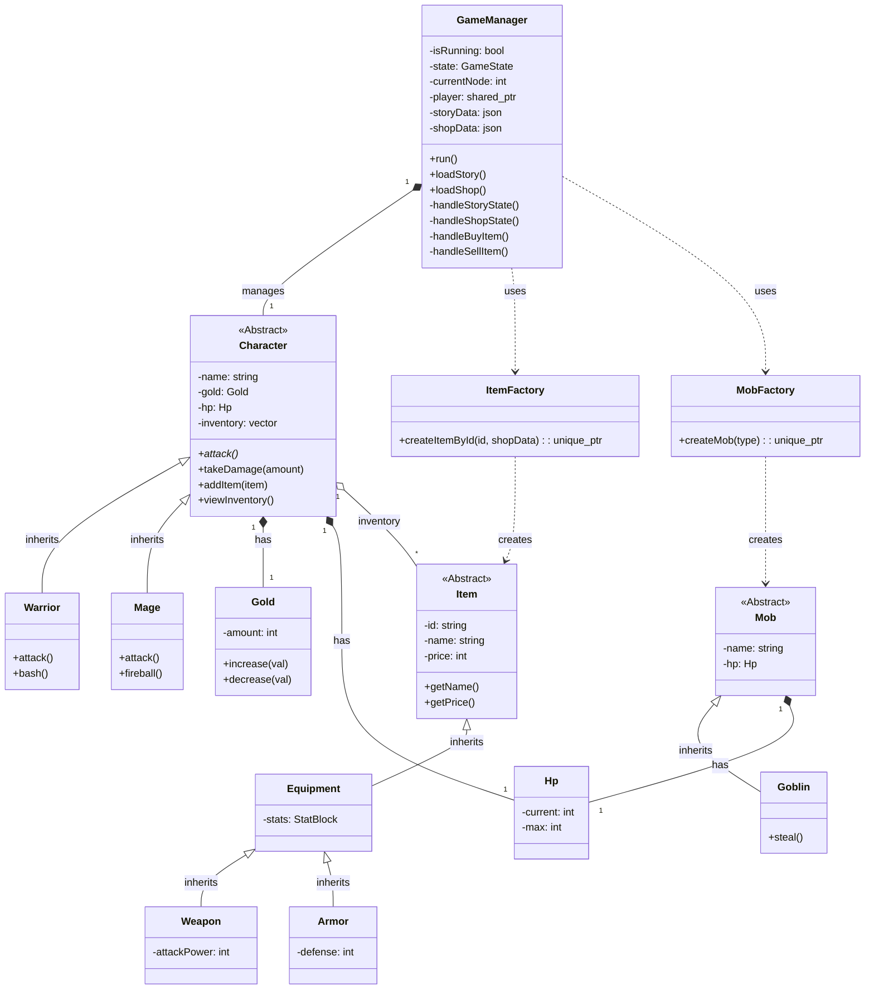

# Project Class Diagram

This diagram shows the current architecture of the `clone_rpg` project using Mermaid syntax. You can view this rendered in IDEs like CLion or VS Code.

```mermaid
classDiagram
    %% Core Management
    class GameManager {
        -isRunning: bool
        -state: GameState
        -currentNode: int
        -player: shared_ptr<Character>
        -storyData: json
        -shopData: json
        +run()
        +loadStory()
        +loadShop()
        -handleStoryState()
        -handleShopState()
        -handleBuyItem()
        -handleSellItem()
    }

    %% Character System
    class Character {
        <<Abstract>>
        -name: string
        -gold: Gold
        -hp: Hp
        -inventory: vector<Item*>
        +attack()*
        +takeDamage(amount)
        +addItem(item)
        +viewInventory()
    }
    class Warrior {
        +attack()
        +bash()
    }
    class Mage {
        +attack()
        +fireball()
    }

    %% Item System
    class Item {
        <<Abstract>>
        -id: string
        -name: string
        -price: int
        +getName()
        +getPrice()
    }
    class Equipment {
        -stats: StatBlock
    }
    class Weapon {
        -attackPower: int
    }
    class Armor {
        -defense: int
    }
    class ItemFactory {
        +createItemById(id, shopData): unique_ptr<Item>
    }

    %% Mob System
    class Mob {
        <<Abstract>>
        -name: string
        -hp: Hp
    }
    class Goblin {
        +steal()
    }
    class MobFactory {
        +createMob(type): unique_ptr<Mob>
    }

    %% Utility & Stats
    class Gold {
        -amount: int
        +increase(val)
        +decrease(val)
    }
    class Hp {
        -current: int
        -max: int
    }

    %% Relationships
    GameManager "1" *-- "1" Character : manages
    GameManager ..> ItemFactory : uses
    GameManager ..> MobFactory : uses
    
    Character <|-- Warrior : inherits
    Character <|-- Mage : inherits
    Character "1" *-- "1" Gold : has
    Character "1" *-- "1" Hp : has
    Character "1" o-- "*" Item : inventory

    Item <|-- Equipment : inherits
    Equipment <|-- Weapon : inherits
    Equipment <|-- Armor : inherits
    
    Mob <|-- Goblin : inherits
    Mob "1" *-- "1" Hp : has

    ItemFactory ..> Item : creates
    MobFactory ..> Mob : creates
```
